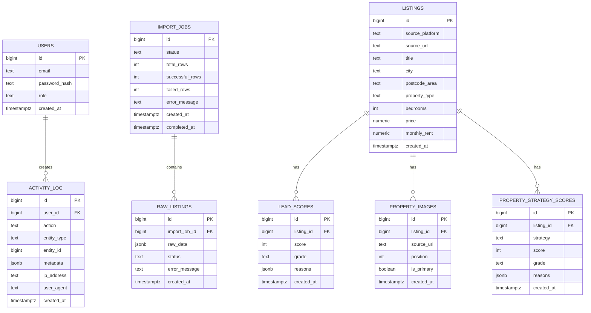

# EstateLink Database Relationship Diagram

## Current + Pivot Schema



---

## Core Relationship Meaning

```txt
users
↓
activity_log
```

Users trigger actions such as login, imports, listing ingestion, and admin changes.

```txt
import_jobs
↓
raw_listings
```

An import job can contain many raw listing records.

```txt
listings
↓
lead_scores
```

A listing can have one or more lead score records.

```txt
listings
↓
property_images
```

A listing can have multiple scraped image URLs.

```txt
listings
↓
property_strategy_scores
```

A listing can now have multiple investment strategy scores.

Example strategies:

```txt
buy_to_let
brrrr
flip
buy_and_hold
hmo
development
```

---

## Pivot Direction

The old model was:

```txt
listing
↓
lead score
```

The new model becomes:

```txt
listing / property
├── images
├── lead score
├── buy-to-let score
├── BRRRR score
├── flip score
├── buy-and-hold score
├── HMO score
└── development score
```

This is the foundation for EstateLink becoming a property opportunity intelligence platform rather than just a listings importer.
